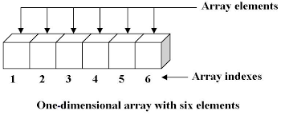

# Lecture 5
.png)
# Table of Contant
## 1)Array
## 2)Method of Array
># What is Array

## Array in objecte ast ki metavonad dar daruni khud chand chizro metavonad nigoh dorad hamchunin array object; An array is an object that holds values (of any type) not particularly in named properties/keys,but rather in numerically indexed position
```
for Example : 
let arr = [1,"Hello",3,{},"hi",[]]
```
## Change element in array or add new element and creat array;
```
    /// js                                     output
let arr = [1,"Hello",3,{},"hi",[]]
console.log(arr);                        [1,"Hello",3,{},"hi",[]]
console.log(arr[2]);                       3
    /// change element in array
let arr = [1,"Hello",3,{},"hi",[]]
arr[2]="we"
console.log(arr[2])                    [1,"Hello","we,{},"hi",[]]
    /// addnew element in array
let arr = [1,"Hello",3,{},"hi",[]]       
arr[6]="we"
console.log(arr)                       [1,"Hello",3,{},"hi",[]]
console.log(arr[6])                     we
```
# Methods of Array;

## 1)push() : - az okhiri arrary dobavit mekna The push() method adds one or more elements to the end of an array and returns the new length of the array. arrayi glavnira alish mekna
```
    /////  js                                output
let arr = [1,"Hello",3,{},"hi",3,[]]
let arr2 = arr.push(1,2)
console.log(arr2);                 [1,"Hello",3,{},"hi",3,[],1,2]
console.log(arr); // show length                9
```
## 1)pop() : - az akhiri array iak elementro nisho meta The pop() method removes the last element from an array and returns that element.This method changes the length of the array arrayi asosira alish mekna
```
    /////  js                                output
let arr = [1,"Hello",3,{},"hi",3,[]]
let arr2 = arr.pop(1,2)
console.log(arr2);                           2
console.log(arr);                [1,"Hello",3,{},"hi",3,[],1,2]
```
## 1)unshift() : - unshift methode hast iak va io iakchandto element az avvali array dobavit mekunad The unshift() method adds one or more elements to the beginning of an array and returns the new length of the array. unshift arrayi glavnira alish mekunad
```
    /////  js                                output
let arr = [1,"Hello",3,{},"hi",3]
let arr2 = arr.unshift("we",10)
console.log(arr2); // show lengt;          8
console.log(arr);             ["we",10,1,"Hello",3,{},"hi",3]
```
## 1)shift() : - shift in methode hast ki az avvali massiv iaktoro udalit mekunad, The pop() method removes the last element from an array and returns that element.This method changes the length of the array. in method arrayi asosiro alish mekunad
```
    /////  js                                output
let arr = [1,"Hello",3,{},"hi",3]
let arr2 = arr.shift()
console.log(arr2);                            1
console.log(arr);                    ["Hello",3,{},"hi",3]
```
># Javascipt array methods
## 1)indexOf() : - baroi ioftani element indexashro
```
// js                                            output
let arr = [1,"Hello",3,{},"hi",3] 
console.log(arr.indexOf("hi"));                4
```
## 1)lastIndexOf() : - baroi ioftani element indexashro agar iakchandto iak khele boshad indexi khoronashro mishon mete
```
// js                                            output
let arr = [1,"Hello",3,{},"hi","Hello"] 
console.log(arr.lastIndexOf("Hello"));               5
```
## 2)includes() : - jabobi includes true io false ast mesangad agar boshad true dar aini hol fase
```
// js                                            output
let arr = [1,"Hello",3,{},"hi",3]
console.log(arr.includes(3));                   true
console.log(arr.includes("we"));                false
```
## 2)slice() : - az indexi chand to indexi chand elementro nishon dihad dra parametr du chiz start , end
```
// js                                            output
let arr = [1,"Hello",3,{},"hi",3]
console.log(arr.slice(1,-1));             ["Hello",3,{},"hi"]
```
## 2)concat() : - du arrayro mechasponad
```
// js                                            output
let arr = [1,"Hello",3,{},"hi",3]
let ar2 = [1,2,4,10]
console.log(arr.concat(ar2));    [1,"Hello",3,{},"hi",3,1,2,4,10]
```
## 2)slice() : - az indexi chand to indexi chand elementro nishon dihad dra parametr du chiz start , end
```
// js                                            output
let arr = [1,"Hello",3,{},"hi",3]
console.log(arr.slice(1,-1));             ["Hello",3,{},"hi"]
```
## 2)splice() : - methodi array hast ki dar parametr 3 chiz kabul meknad 1 - az chandum index sar knad , 2 - chandto udali knad , 3 - chandto dobavit knad; arrayi glavnira alish meknad
```
// js                                            output
let arr = [1,"Hello",3,{},"hi",3]
let arr2 = arr.splice(1,2,"wow")
console.log(arr);                [1,"wow",{},"hi",3]
console.log(arr2);               ["Hello",3]
```
># Array Method Callbacks;
.jpg)
# What is callback method :
>## ##calback method is amethod that hav callback in its parametr and its callback has function
## 1)forEach(() => {}) : - forEach method baroi nishon dodani element io ind io array dar parametrash callback va callback boshad 3 chiz element, index, array kabul mekunad
```
/// js
let arr = [1,"Hello",3,{},"hi",3]
console.log(arr.forEach((elem,ind,arr) => {
    console.log(elem,ind,arr);
}));
 /// output:
1 0 [ 1, 'Hello', 3, {}, 'hi', 3 ]
Hello 1 [ 1, 'Hello', 3, {}, 'hi', 3 ]
3 2 [ 1, 'Hello', 3, {}, 'hi', 3 ]
{} 3 [ 1, 'Hello', 3, {}, 'hi', 3 ]
hi 4 [ 1, 'Hello', 3, {}, 'hi', 3 ]
3 5 [ 1, 'Hello', 3, {}, 'hi', 3 ]
```
## 2)map(() => {}) : - map method in dar parametr callback kabul mekunad va callback boshad 3 chiz element, index, array kabul mekunad
```
/// js
let arr = [1,2,3,4,5]
console.log(arr.map((elem) => {
    console.log(elem+1);
}));
 /// output:
2
3
4
5
6
```
## 2)find(() => {}) : - find in methode hast ki az daruni array agar usloviamona ioft stop mekna;
```
/// js
let arr = [1,2,3,4,5]
let res = arr.find((elem) => {
    return elem > 3
})
console.log(res);
}));
 /// output:
4
```
## 2)reduce(() => {}) : - reduce in methode hast ki dar parametrash 2 chiz accumliator va curantvalue ian a,b kabul mekunad rwsultati gam zarb tarh io uigon chizro metavonem barorem
```
/// js
let arr = [1,2,3,4,5]
let res = arr.reduce((a,b) => {
    return a+b
})
console.log(res);
}));
 /// output:
       15
```
## 2)filter(() => {}) : - in metode hast ki filter mekunad elemnt hoera ki mo dar uslovia monem nishon mete dar paramet callback va callback 3 parametr elem,ind arr;
```
/// js
let arr = [1,2,3,4,5]
let res = arr.filter((elem) => {
    return elem%2 == 0
})
console.log(res);
}));
 /// output:
    [2,4]
```
## 2)sort(() => {}) : - in methode hast ki dar parametr callback va callback 2 parametr a , b kabul mekunad sort arrayi asosira ivaz mekunad; ba misli hamin to/sorted hast misli sort kor mekunad ammo arrayi asosiro ivaz namekunad;
```
/// js
let arr = [4,8,2,9,10]
let res = arr.sort((a,b) => {
    return a-b
})
console.log(res);
}));
 /// output:
    [2,4,8,9,10]
```
># Array mekhanizm:

## 1)Destructuring : - az array eementhoro hamchun variable megirad;
```
//js                                     output:
let arr = [4,8,2,9,10]
let [a,b,...c] = arr
console.log(a);                        4
console.log(c);                       [2,9,8]
console.log(c[1]);                     9 
```
## 2)Spread : - arrayro dar iak variabli diagar mondan
```
let arr = [4,8,2,9,10]                output :
let arr2 = [...arr]
arr2.push(1,2)
console.log(arr2);                 [4,8,2,9,10,1,2] 
console.log(arr);                   [4,8,2,9,10] 
```
## 3)Rest : - variable horo iak aray mekunad;
```
let res = (...a) => {
    return a
}
console.log(res(2,3,4,5,6));               [2,3,4,5,6]
``` 